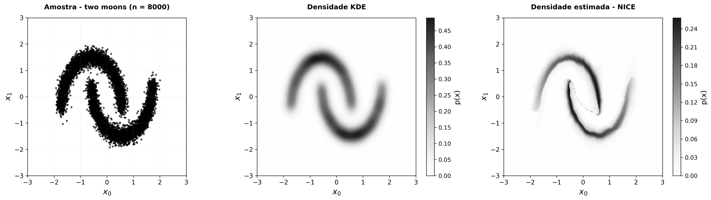
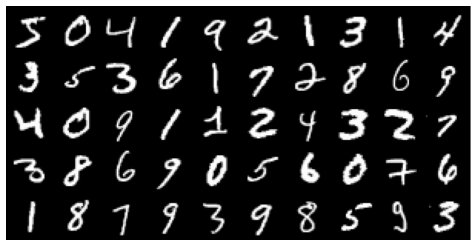
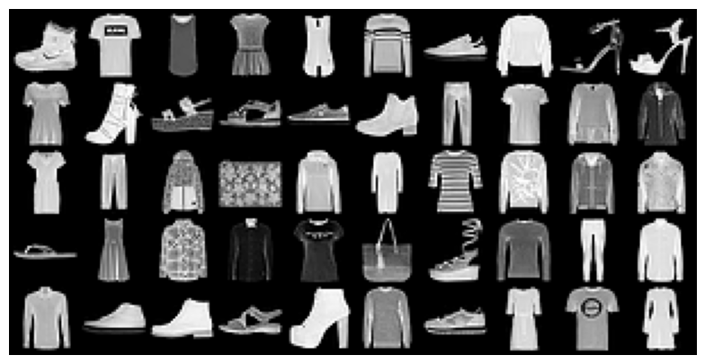

# TCC Marco Guibor
## Sobre
Esse repositório contém os códigos utilizados no meu Trabalho de Conclusão de Curso (TCC) em Estatística e Ciência de Dados pela UFPR.

O objetivo é compreender o NICE como um método de estimação de densidades e aprendizado generativo, e comparar com KDE e GANs.

Na estimação de densidades, foi utilizado o pacote **[normflows](https://github.com/VincentStimper/normalizing-flows)**. No aprendizado generativa, foi realizada adaptações da implementação de **[Ofekirsch](https://github.com/Ofekirsh/Non-Linear-Independent-Components-Estimation)**.

## Pré-requisitos
- Python 3.x
- torch==2.9.0
- numpy==2.3.4
- matplotlib==3.10.7
- scikit-learn==1.7.2
- normflows==1.7.3

Para instalar as dependências em um ambiente virtual, utilize:

```bash
python -m venv .venv
.venv\Scripts\activate
```

```bash
pip install -r requirements.txt
```

Para instalar a versão com suporte a GPU (CUDA), utilize:

```bash
pip uninstall torch torchvision torchaudio -y
pip install torch torchvision torchaudio --index-url https://download.pytorch.org/whl/cu121
```
## 0 - Estrutura de pastas

Os códigos desenvolvidos estão nas pastas **[main/density_estimation](https://github.com/marcoaguibor/tcc_marcoguibor_2025-teste/tree/main/main/generative_learning)** e **[main/generative_learning](https://github.com/marcoaguibor/tcc_marcoguibor_2025-teste/tree/main/main/density_estimation)**. Os resultados são salvos na pasta **[plots](https://github.com/marcoaguibor/tcc_marcoguibor_2025-teste/tree/main/plots)**

## 1 - Estimação de densidades

Para aplicar a estimação de densidades em two_moons, utilizando o NICE e KDE:

```bash
python main/density_estimation/density_estimation.py
```
<p align="center">
  
</p>

## 2 - Aprendizado generativo

Para gerar a amostra original das bases MNIST e Fashion-MNIST:

```bash
python main/generative_learning/original_sampling.py
```

<p align="center">
  

<p align="center">
  
</p>

Para treinamento apresentado no TCC, utiliza-se, como exemplo, os comandos:

### NICE

```bash
python main/generative_learning/train.py --method nice --sample-size 32 --dataset mnist  --coupling 10 --prior gaussian --coupling-type additive --mid-dim 1024 --hidden 8 --lr 0.0005 
```

### GAN
```bash
python main/generative_learning/train.py --method gan --sample-size 32 --dataset fashion-mnist --latent-dim 100 --lr 0.0005 --epochs 50 --batch-size 128
```

Abaixo, segue tabela adaptada com parâmetros que podem ser aplicados: 

| Argumento            | Descrição                                                                      | Aplicabilidade |
|----------------------|--------------------------------------------------------------------------------|----------------|
| `--method`           | Seleciona qual modelo será treinado (NICE flow ou GAN)                        | Ambos          |
| `--dataset`          | Dataset a ser usado: `mnist` ou `fashion-mnist`                               | Ambos          |
| `--batch-size`       | Número de amostras processadas por iteração de treinamento                    | Ambos          |
| `--epochs`           | Número total de épocas de treinamento                                         | Ambos          |
| `--lr`               | Taxa de aprendizado para otimização                                           | Ambos          |
| `--no-cuda`          | Desabilita o uso de GPU, força treinamento em CPU                             | Ambos          |
| `--gpu`              | ID da GPU a ser utilizada (quando múltiplas GPUs disponíveis)                 | Ambos          |
| `--num-workers`      | Número de processos para carregamento de dados                                | Ambos          |
| `--sample-interval`  | Intervalo de épocas para gerar e salvar amostras de imagens                   | Ambos          |
| `--sample-size`      | Número de imagens a serem geradas em cada amostragem                          | Ambos          |
| `--prior`            | Distribuição latente: `logistic` ou `gaussian`                                | NICE           |
| `--coupling`         | Número de camadas de acoplamento (coupling layers)                            | NICE           |
| `--coupling-type`    | Tipo de transformação nas coupling layers: `additive` ou `affine`             | NICE           |
| `--mid-dim`          | Dimensão das camadas ocultas intermediárias                                   | NICE           |
| `--hidden`           | Número de camadas ocultas em cada coupling layer                              | NICE           |
| `--lr-schedule`      | Habilita scheduler de learning rate (ReduceLROnPlateau)                       | NICE           |
| `--latent-dim`       | Dimensão do espaço latente (vetor z de entrada do generator)                  | GAN            | 
